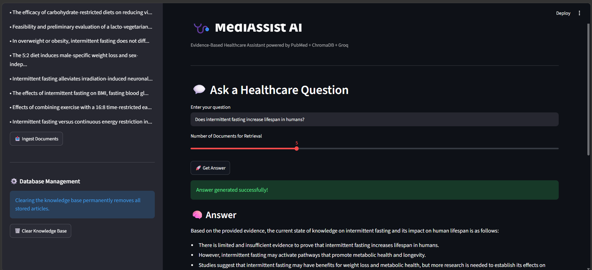
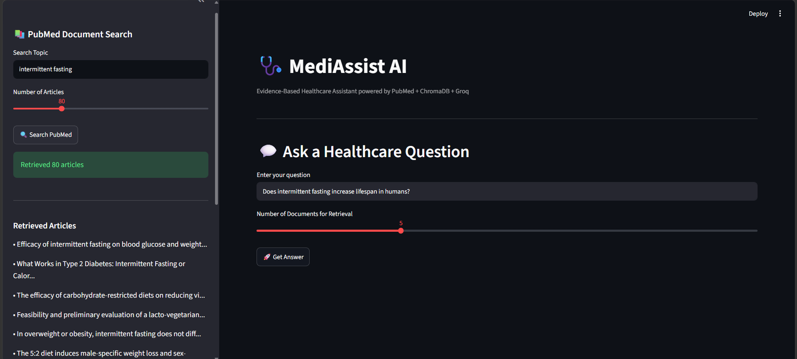

# 🩺 MediAssist AI - Healthcare Question Answering System

## 📌 Project Overview

MediAssist AI is a Retrieval-Augmented Generation (RAG) based healthcare assistant that retrieves medical research articles from PubMed, stores them in a vector database, and generates evidence-based answers using the Groq Llama 3 model.

The application combines:

- PubMed for medical literature retrieval
- ChromaDB for vector storage and semantic search
- Groq LLMs for answer generation
- Streamlit for an interactive user interface

The system helps users ask healthcare-related questions and receive answers grounded in scientific evidence.

---

# 🚀 Features

### 📚 PubMed Article Retrieval

- Search medical research articles from PubMed
- Retrieve up to 300 articles per search
- Extract PMID, title, abstract, journal, authors, and publication year

### 🗄️ Vector Database Integration

- Store research articles in ChromaDB
- Enable semantic similarity search
- Build a reusable healthcare knowledge base

### 🤖 AI-Powered Question Answering

- Uses Groq-hosted Llama 3
- Retrieves relevant scientific evidence
- Generates grounded responses using RAG

### 🎨 Streamlit User Interface

- Search PubMed directly from the UI
- Ingest articles into the vector database
- Ask healthcare questions
- Display sources and retrieved evidence
- Clear the knowledge base when required

---

# 🏗️ System Architecture

```text
User Query
     │
     ▼
ChromaDB Semantic Search
     │
     ▼
Relevant Documents Retrieved
     │
     ▼
Context Construction
     │
     ▼
Groq Llama 3
     │
     ▼
Evidence-Based Answer
```

---

# 📂 Project Structure

```text
Healthcare_QA_Project/
│
├── app.py
├── pubmed.py
├── chroma_manager.py
├── generator.py
├── ingest.py
├── main.py
├── delete_collection.py
├── requirements.txt
├── .gitignore
├── .env
│
├── chroma_db/
├── screenshots/
│   └── app_ui.png
│
└── venv/
```

---

# 🌐 Streamlit Application

## Application Screenshot

<br>




<br>

The Streamlit application provides an intuitive interface for:

- Searching PubMed articles
- Ingesting documents into ChromaDB
- Asking healthcare questions
- Viewing AI-generated answers
- Reviewing retrieved sources and evidence

---

# ⚙️ Installation

## 1. Clone the Repository

```bash
git clone <repository-url>
cd Healthcare_QA_Project
```

## 2. Create a Virtual Environment

### Windows

```bash
python -m venv venv
```

Activate:

```bash
.\venv\Scripts\Activate.ps1
```

### Linux / Mac

```bash
python3 -m venv venv
source venv/bin/activate
```

## 3. Install Dependencies

```bash
pip install -r requirements.txt
```

## 4. Configure Environment Variables

Create a `.env` file:

```env
GROQ_API_KEY=your_groq_api_key
```

---

# 📥 Data Retrieval Workflow

### Search PubMed Articles

```python
pmids = PubMedRetriever.search_pubmed_articles(
    "intermittent fasting",
    max_results=200
)
```

### Fetch Article Metadata

```python
articles = PubMedRetriever.fetch_pubmed_abstracts(pmids)
```

Retrieved metadata includes:

- PMID
- Title
- Abstract
- Journal
- Authors
- Publication Date

---

# 🗄️ Document Ingestion

Articles are stored in ChromaDB.

```python
manager.add_article(article)
```

---

# 🔍 Semantic Search

```python
results = manager.search(
    query=question,
    n_results=5
)
```

The vector database returns the most relevant documents.

---

# 🧠 Answer Generation

```python
context = build_context(results)

answer = generate_answer(
    question,
    context
)
```

### Model Used

```text
llama-3.1-8b-instant
```

### Provider

```text
Groq
```

---

# ▶️ Running the Application

```bash
streamlit run app.py
```

Open:

```text
http://localhost:8501
```

---

# 💡 Example Questions

### Weight Loss

- Does intermittent fasting help with weight loss?
- How effective is intermittent fasting for obesity management?

### Diabetes

- Does intermittent fasting improve blood glucose control?
- Can intermittent fasting improve insulin sensitivity?

### Metabolic Health

- What are the health benefits of intermittent fasting?
- What does current research say about intermittent fasting?

### Research-Based Questions

- Compare intermittent fasting and calorie restriction for weight loss.
- What are the limitations of current intermittent fasting studies?

---

# 🧹 Clearing the Knowledge Base

```python
client.delete_collection(
    "pubmed_articles"
)
```

This functionality is available from the Streamlit sidebar.

---

# 📦 Requirements

```text
streamlit
chromadb
groq
python-dotenv
requests
```

Install:

```bash
pip install -r requirements.txt
```

---

# 🔒 Security

Store your Groq API key securely:

```env
GROQ_API_KEY=your_groq_api_key
```

Never commit your `.env` file.

Recommended `.gitignore`:

```gitignore
venv/
chroma_db/
.env
__pycache__/
.idea/
.vscode/
```

---

# 📈 Future Enhancements

- Multi-topic healthcare knowledge base
- Advanced source citation visualization
- PDF export of generated answers
- User authentication
- Conversation history
- RAG evaluation metrics

---

# 👩‍💻 Author

**Anuja Nagrikar**

---

# 📄 License

This project is intended for educational and research purposes.